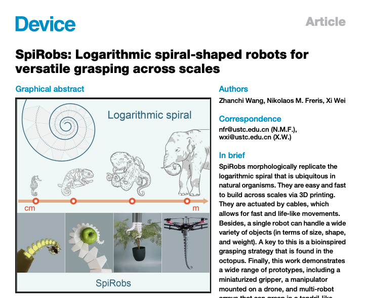
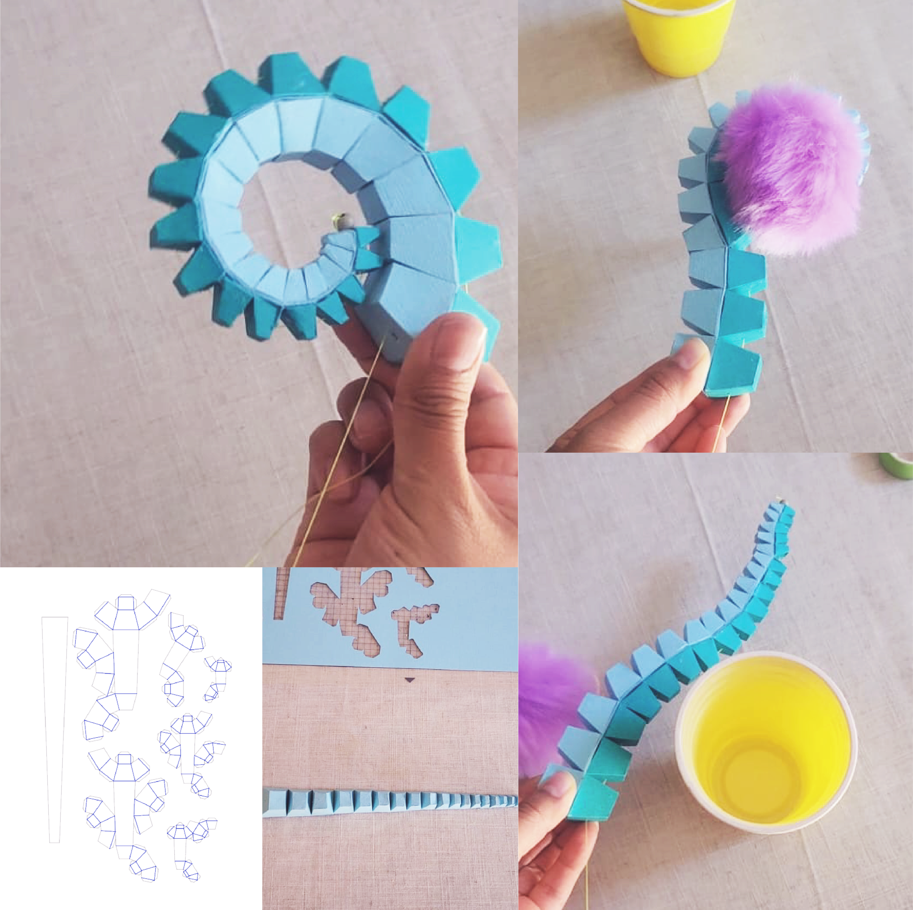

# SpiRob Origami 

Este repositorio contiene mi versión en origami inspirada en el artículo:

**SpiRobs: Logarithmic spiral-shaped robots for versatile grasping across scales** Wang, Zhanchi et al. (2024).

Puedes leer el artículo completo y acceder a los archivos STL oficiales (versiones 2D y 3D) en la página de la revista: [enlace al artículo](https://www.cell.com/device/fulltext/S2666-9986(24)00603-3?_returnURL=https%3A%2F%2Flinkinghub.elsevier.com%2Fretrieve%2Fpii%2FS2666998624006033%3Fshowall%3Dtrue)

---

## Sobre mi versión

Esta versión fue creada como una representación en cartulina del diseño SpiRob, considerando sus bases matemáticas para formar una espiral logarítmica.

- El modelo fue cortado en cartulina utilizando una **Silhouette Cameo 4**.
- Incluyo los archivos en formato **DXF** para plotters de corte y doblado y en **PNG** y **SVG** para corte manual. *(Para fabricar el brazo completo, se debe hacer el corte dos veces de este modelo para unirlo y alcanzar la simetría. Revisa las imágenes de referencia y el link al video de más abajo como guia)*
- Se utilizó un hilo de pescar para controlar el enrrollamiento y desenrrollamiento del brazo.
- Este trabajo es personal y con fines educativos y de divulgación.

## Comentarios

El brazo está basado en una estructura simétrica. Si se fabrica sólo una de sus caras, es posible lograr un enrollamiento eficiente al traccionar el hilo que lo atraviesa, pero no se obtiene un desenrollamiento completo y deseable debido a las propiedades estáticas de la cartulina, a diferencia de su versión impresa en TPU. Por ello, es recomendable **construir ambas mitades y pegarlas para replicar el diseño original propuesto por los autores**. Esta simetría permite una mejor distribución de las fuerzas, mayor control sobre las deformaciones y la posibilidad de cubrir un área de trabajo más amplia.

Ya que el modelo de cartulina es hueco y estructuralmente más frágil, su capacidad para sujetar objetos mayor a 15g es limitada. Sin embargo, podría explorarse la opción de rellenarlo parcialmente con algodón u otro material liviano para aumentar un poco su "potencia". Esta idea es una hipótesis, abierta a ser experimentada :)

[Video del resultado de esta versión origami en mi instagram](https://www.instagram.com/p/DGn_4GtSkRy/)
____

Espero que esta versión les sea útil e inspiradora para experimentar con nuevas formas de representar robótica blanda desde un enfoque accesible y maker.

Si deseas experimentar con los diseños originales de los autores e imprimirlos en TPU, visita el [artíuclo en la página de la revista](https://www.cell.com/device/fulltext/S2666-9986(24)00603-3?_returnURL=https%3A%2F%2Flinkinghub.elsevier.com%2Fretrieve%2Fpii%2FS2666998624006033%3Fshowall%3Dtrue) en la sección de **Supplemental information** que se encuentra antes de la sección de Referencias. Ahí están los descargables en formato **STL** de las versiónes 2D y 3D del brazo **Spirobs**.

